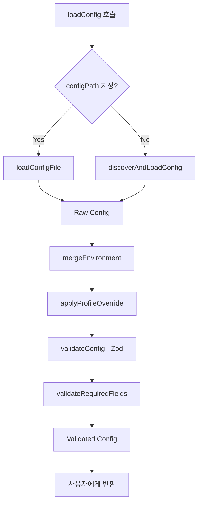

# Config System

SCF의 설정 관리 시스템입니다. TypeScript로 작성된 설정 파일을 런타임에 로드하고, Zod로 검증하며, 환경별 설정 병합을 지원합니다.

## 📁 파일 구조

```
src/core/config/
├── schema.ts      # Zod 검증 스키마 정의
├── loader.ts      # TypeScript config 파일 로더 (jiti)
├── merger.ts      # 환경별 설정 병합 로직
├── utils.ts       # 헬퍼 함수 (defineConfig 등)
├── index.ts       # 통합 entry point
└── README.md      # 본 문서
```

---

## 📄 파일별 상세 설명

### 1. `schema.ts` - Zod 검증 스키마

**목적**: 설정 파일의 구조를 검증하고 기본값을 제공합니다.

#### 주요 스키마

**`configSchema`**
```typescript
const configSchema = z.object({
  app: z.string().min(1).regex(/^[a-z0-9-]+$/),
  region: z.string().regex(/^[a-z]{2}-[a-z]+-\d+$/),
  credentials: awsCredentialsSchema.optional(),
  s3: s3ConfigSchema.optional(),
  cloudfront: cloudfrontConfigSchema.optional(),
  environments: z.record(z.string(), z.any()).optional(),
});
```

**`s3ConfigSchema`**
- `bucketName`: S3 버킷 이름 (3-63자, 소문자/숫자/하이픈)
- `buildDir`: 빌드 디렉토리 경로
- `indexDocument`: 기본값 `"index.html"`
- `websiteHosting`: 기본값 `true`
- `concurrency`: 기본값 `10` (1-100)
- `gzip`: 기본값 `true`

**`cloudfrontConfigSchema`**
- `enabled`: CloudFront 활성화 여부
- `priceClass`: 기본값 `"PriceClass_100"`
- `defaultTTL`: 기본값 `86400` (1일)
- `maxTTL`: 기본값 `31536000` (1년)
- `ipv6`: 기본값 `true`

#### 내보내기 함수

```typescript
// 검증 (예외 발생)
validateConfig(config: unknown): SCFConfig

// 안전한 검증 (결과 객체 반환)
validateConfigSafe(config: unknown): SafeParseResult<SCFConfig>
```

**사용 예시**:
```typescript
import { validateConfig } from './schema.js';

try {
  const validConfig = validateConfig(rawConfig);
} catch (error) {
  console.error('Config validation failed:', error.message);
}
```

---

### 2. `loader.ts` - Config 파일 로더

**목적**: TypeScript/JavaScript 설정 파일을 런타임에 로드합니다.

#### 지원하는 파일명 (우선순위 순)

1. `scf.config.ts`
2. `scf.config.js`
3. `scf.config.mjs`
4. `scf.config.cjs`

#### 주요 함수

**`findConfigFile(startDir?: string): string | null`**

현재 디렉토리부터 상위 디렉토리까지 설정 파일을 탐색합니다.

```typescript
const configPath = findConfigFile();
// → "/Users/user/project/scf.config.ts"
```

**`loadConfigFile(configPath: string): Promise<SCFConfig>`**

지정된 경로의 설정 파일을 jiti를 사용하여 로드합니다.

```typescript
const config = await loadConfigFile('./scf.config.ts');
```

**지원하는 export 형식**:
```typescript
// 1. 객체 export
export default { app: 'my-app', ... };

// 2. default export
export default defineConfig({ ... });

// 3. 함수 export
export default () => ({ ... });

// 4. default 함수 export
export default { default: () => ({ ... }) };
```

**`discoverAndLoadConfig(startDir?: string)`**

자동으로 설정 파일을 찾아 로드합니다.

```typescript
const { config, configPath } = await discoverAndLoadConfig();
console.log(`Loaded from: ${configPath}`);
```

#### 에러 처리

```typescript
// 파일을 찾을 수 없는 경우
Error: Config file not found. Please create one of: scf.config.ts, ...

// 로드 실패
Error: Failed to load config file: /path/to/config
```

---

### 3. `merger.ts` - 환경별 설정 병합

**목적**: 기본 설정과 환경별 설정을 Deep Merge합니다.

#### 주요 함수

**`mergeEnvironment(baseConfig: SCFConfig, environment?: string): SCFConfig`**

환경별 설정을 병합합니다.

```typescript
const baseConfig = {
  app: 'my-app',
  region: 'us-east-1',
  s3: { bucketName: 'base-bucket' },
  environments: {
    prod: {
      s3: { bucketName: 'prod-bucket' }
    }
  }
};

const prodConfig = mergeEnvironment(baseConfig, 'prod');
// Result:
// {
//   app: 'my-app',
//   region: 'us-east-1',
//   s3: { bucketName: 'prod-bucket' }  // ← 병합됨
// }
```

**Deep Merge 규칙**:
- 중첩된 객체는 재귀적으로 병합
- 배열은 덮어씀 (병합 안함)
- `undefined` 값은 무시
- 환경 설정이 우선

**`applyProfileOverride(config: SCFConfig, profileOverride?: string): SCFConfig`**

CLI `--profile` 옵션을 적용합니다.

```typescript
const config = applyProfileOverride(baseConfig, 'production');
// config.credentials.profile === 'production'
```

---

### 4. `utils.ts` - 유틸리티 함수

**목적**: 사용자 친화적인 헬퍼 함수를 제공합니다.

#### 주요 함수

**`defineConfig(config: SCFConfig): SCFConfig`**

타입 안전한 설정 정의를 위한 헬퍼 함수입니다. IDE 자동완성 지원.

```typescript
// 사용자 설정 파일에서
import { defineConfig } from 'scf';

export default defineConfig({
  app: 'my-app',
  region: 'ap-northeast-2',
  s3: {
    bucketName: 'my-bucket',
    buildDir: './dist',
  }
});
```

**`generateExampleConfig(appName?: string): string`**

예제 설정 파일 내용을 생성합니다 (init 명령어용).

```typescript
const example = generateExampleConfig('my-site');
console.log(example);
// → "import { defineConfig } from 'scf'; ..."
```

**`validateRequiredFields(config: SCFConfig): void`**

필수 필드 검증 (추가 검증 레이어).

```typescript
validateRequiredFields(config);
// Throws if: app, region, s3.bucketName 등이 없음
```

---

### 5. `index.ts` - 통합 Entry Point

**목적**: 모든 config 기능을 통합하여 하나의 함수로 제공합니다.

#### 메인 함수

**`loadConfig(options?: LoadConfigOptions): Promise<SCFConfig>`**

설정 파일을 로드하고 검증하는 전체 프로세스를 실행합니다.

**옵션**:
```typescript
interface LoadConfigOptions {
  configPath?: string;  // 설정 파일 경로 (기본: 자동 탐색)
  env?: string;         // 환경 이름 (예: 'dev', 'prod')
  profile?: string;     // AWS profile 오버라이드
}
```

**프로세스**:
1. 📁 설정 파일 로드 (`configPath` 또는 자동 탐색)
2. 🔀 환경별 설정 병합 (`env`)
3. 👤 Profile 오버라이드 적용 (`profile`)
4. ✅ Zod 스키마 검증
5. ✅ 필수 필드 검증
6. 📝 로드 정보 출력 (CLI 모드)

**사용 예시**:

```typescript
import { loadConfig } from './core/config/index.js';

// 1. 기본 로드
const config = await loadConfig();

// 2. 환경 지정
const prodConfig = await loadConfig({ env: 'prod' });

// 3. 커스텀 경로
const config = await loadConfig({
  configPath: './custom.config.ts'
});

// 4. Profile 오버라이드
const config = await loadConfig({
  env: 'prod',
  profile: 'my-aws-profile'
});
```

#### Re-exports

```typescript
// 유틸리티
export { defineConfig, generateExampleConfig } from './utils.js';

// 타입
export type { SCFConfig, LoadConfigOptions } from '../../types/config.js';
```

---

## 🎯 전체 워크플로우



---

## 💡 사용 예시

### 기본 사용법

**1. 설정 파일 생성** (`scf.config.ts`)

```typescript
import { defineConfig } from 'scf';

export default defineConfig({
  app: 'my-website',
  region: 'ap-northeast-2',

  s3: {
    bucketName: 'my-website-bucket',
    buildDir: './dist',
    indexDocument: 'index.html',
    gzip: true,
  },

  cloudfront: {
    enabled: true,
    priceClass: 'PriceClass_100',
  },

  environments: {
    dev: {
      s3: {
        bucketName: 'my-website-dev',
      },
      cloudfront: {
        enabled: false,
      },
    },

    prod: {
      s3: {
        bucketName: 'my-website-prod',
      },
      cloudfront: {
        enabled: true,
        priceClass: 'PriceClass_All',
        customDomain: {
          domainName: 'example.com',
          certificateArn: 'arn:aws:acm:us-east-1:...',
        },
      },
    },
  },
});
```

**2. 프로그램에서 로드**

```typescript
import { loadConfig } from 'scf';

// Dev 환경
const devConfig = await loadConfig({ env: 'dev' });
console.log(devConfig.s3.bucketName); // "my-website-dev"

// Prod 환경
const prodConfig = await loadConfig({ env: 'prod' });
console.log(prodConfig.s3.bucketName); // "my-website-prod"
console.log(prodConfig.cloudfront?.customDomain?.domainName); // "example.com"
```

---

## 🔍 검증 규칙

### App Name
- 필수
- 최소 1자
- 소문자, 숫자, 하이픈만 허용
- 예: `my-app`, `website-123`

### AWS Region
- 필수
- 형식: `{지역}-{방향}-{숫자}` (예: `ap-northeast-2`, `us-east-1`)

### S3 Bucket Name
- S3 버킷 이름 규칙 준수
- 3-63자
- 소문자, 숫자, 점, 하이픈
- 시작/끝은 소문자나 숫자
- 예: `my-bucket`, `example.com`

### CloudFront Price Class
- `PriceClass_100` (미국, 캐나다, 유럽)
- `PriceClass_200` (위 + 아시아, 중동, 아프리카 일부)
- `PriceClass_All` (전세계)

### Certificate ARN
- `arn:aws:acm:` 로 시작해야 함
- ACM 인증서 ARN 형식

---

## 🚨 에러 핸들링

### Config 파일 없음
```
Error: Config file not found. Please create one of:
  scf.config.ts, scf.config.js, scf.config.mjs, scf.config.cjs
```

### 잘못된 환경 이름
```
Error: Environment "staging" not found in config.
Available environments: dev, prod
```

### 검증 실패
```
Error: Config validation failed:
  - app name is required
  - s3.bucketName must follow S3 naming rules
  - region must be a valid AWS region (e.g., us-east-1)
```

---

## 🧪 테스트

### 단위 테스트 예시

```typescript
import { mergeEnvironment } from './merger.js';

test('merges environment config correctly', () => {
  const base = {
    app: 'test',
    region: 'us-east-1',
    s3: { bucketName: 'base', buildDir: './dist' },
    environments: {
      prod: { s3: { bucketName: 'prod' } }
    }
  };

  const result = mergeEnvironment(base, 'prod');

  expect(result.s3?.bucketName).toBe('prod');
  expect(result.s3?.buildDir).toBe('./dist'); // 유지됨
  expect(result.environments).toBeUndefined(); // 제거됨
});
```

---

## 🔧 확장 포인트

### 커스텀 검증 추가

`schema.ts`에서 `.refine()` 사용:

```typescript
const configSchema = z.object({
  // ...
}).refine(
  (config) => {
    // 커스텀 검증 로직
    return config.s3 || config.cloudfront;
  },
  { message: 'At least one of s3 or cloudfront must be configured' }
);
```

### 환경 변수 지원

`loader.ts`에서 환경 변수 치환:

```typescript
const config = await loadConfigFile(configPath);

// 환경 변수 치환
if (config.s3?.bucketName.startsWith('$')) {
  const envVar = config.s3.bucketName.slice(1);
  config.s3.bucketName = process.env[envVar] ?? config.s3.bucketName;
}
```

---

## 📚 참고 자료

- [Zod Documentation](https://zod.dev/)
- [jiti - Runtime TypeScript Loader](https://github.com/unjs/jiti)
- [AWS SDK v3 - Credentials](https://docs.aws.amazon.com/AWSJavaScriptSDK/v3/latest/modules/_aws_sdk_credential_providers.html)

---

## 📝 TODO

- [ ] Config 파일 캐싱 지원
- [ ] JSON/YAML 형식 지원
- [ ] 환경 변수 자동 치환
- [ ] Config 스키마 출력 명령어 (`scf config:schema`)
- [ ] Config 검증 명령어 (`scf config:validate`)
