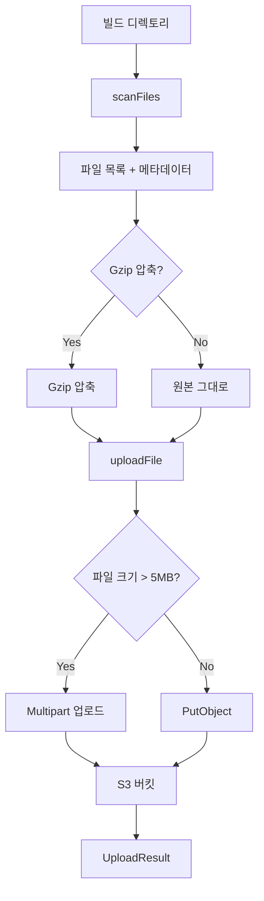

# Deployer Module

파일 스캐닝, 해싱, S3 업로드를 담당하는 배포 유틸리티 모듈입니다.

## 📁 파일 구조

```
src/core/deployer/
├── file-scanner.ts    # 파일 스캔 및 해시 계산
├── s3-uploader.ts     # S3 업로드 로직
├── index.ts           # 통합 entry point
└── README.md          # 본 문서
```

---

## 📄 파일별 상세 설명

### 1. `file-scanner.ts` - 파일 스캔 및 해시

**목적**: 빌드 디렉토리의 파일을 스캔하고, 해시를 계산하며, 메타데이터를 수집합니다.

#### 주요 함수

**`scanFiles(options: ScanOptions): Promise<FileInfo[]>`**

빌드 디렉토리의 모든 파일을 스캔하고 정보를 수집합니다.

```typescript
import { scanFiles } from './file-scanner.js';

const files = await scanFiles({
  buildDir: './dist',
  exclude: ['**/*.map', '**/.DS_Store'],
  followSymlinks: false,
});

files.forEach(file => {
  console.log(`${file.key}: ${file.hash} (${file.size} bytes)`);
});
```

**반환 타입:**
```typescript
interface FileInfo {
  absolutePath: string;    // 절대 경로
  relativePath: string;    // 상대 경로
  key: string;            // S3 key (슬래시 구분)
  size: number;           // 파일 크기 (bytes)
  hash: string;           // SHA-256 해시
  contentType: string;    // MIME type
  shouldGzip: boolean;    // Gzip 압축 여부
}
```

**스캔 옵션:**
```typescript
interface ScanOptions {
  buildDir: string;         // 스캔할 디렉토리
  exclude?: string[];       // 제외할 패턴 (glob)
  followSymlinks?: boolean; // 심볼릭 링크 따라가기
}
```

**`calculateFileHash(filePath: string): Promise<string>`**

단일 파일의 SHA-256 해시를 계산합니다.

```typescript
const hash = await calculateFileHash('/path/to/file.js');
console.log(hash); // "a1b2c3d4..."
```

**`filterChangedFiles(files: FileInfo[], existingHashes: Record<string, string>): FileInfo[]`**

이전 해시와 비교하여 변경된 파일만 필터링합니다 (증분 배포용).

```typescript
const existingHashes = {
  'index.html': 'old-hash-1',
  'main.js': 'old-hash-2',
};

const changedFiles = filterChangedFiles(files, existingHashes);
console.log(`${changedFiles.length} files changed`);
```

**`groupFilesByCompression(files: FileInfo[]): { gzipped: FileInfo[]; plain: FileInfo[] }`**

파일을 압축 여부에 따라 그룹화합니다.

```typescript
const { gzipped, plain } = groupFilesByCompression(files);
console.log(`Gzipped: ${gzipped.length}, Plain: ${plain.length}`);
```

#### Gzip 압축 대상 파일

다음 확장자를 가진 파일은 자동으로 `shouldGzip: true`로 설정됩니다:

```typescript
const GZIPPABLE_EXTENSIONS = [
  '.html', '.htm',      // HTML
  '.css',               // CSS
  '.js', '.mjs',        // JavaScript
  '.json',              // JSON
  '.xml', '.svg',       // XML, SVG
  '.txt', '.md', '.csv',// 텍스트
  '.ts', '.tsx', '.jsx',// TypeScript/JSX
];
```

#### Content-Type 자동 감지

`mime-types` 라이브러리를 사용하여 파일 확장자로부터 MIME type을 자동 감지합니다:

| 확장자 | Content-Type |
|--------|-------------|
| .html | text/html |
| .css | text/css |
| .js | application/javascript |
| .json | application/json |
| .png | image/png |
| .jpg | image/jpeg |
| .svg | image/svg+xml |
| ... | ... |

알 수 없는 파일은 `application/octet-stream`으로 설정됩니다.

#### S3 Key 변환

파일 경로를 S3 key로 변환할 때 다음 규칙을 따릅니다:

```typescript
// Windows 경로 → S3 key
"build\\assets\\main.js" → "build/assets/main.js"

// Unix 경로 → S3 key (변경 없음)
"build/assets/main.js" → "build/assets/main.js"
```

항상 forward slash(`/`)를 사용하며, leading slash는 제거됩니다.

---

### 2. `s3-uploader.ts` - S3 업로드 로직

**목적**: 파일을 S3에 업로드하는 핵심 로직을 제공합니다.

#### 주요 함수

**`uploadFile(client: S3Client, bucketName: string, file: FileInfo, options?: UploadOptions): Promise<UploadResult>`**

단일 파일을 S3에 업로드합니다.

```typescript
import { uploadFile } from './s3-uploader.js';
import { createS3Client } from '../aws/client.js';

const s3Client = createS3Client(config);

const result = await uploadFile(s3Client, 'my-bucket', file, {
  gzip: true,
  dryRun: false,
});

if (result.success) {
  console.log(`✓ Uploaded ${file.key} in ${result.duration}ms`);
} else {
  console.error(`✗ Failed: ${result.error}`);
}
```

**반환 타입:**
```typescript
interface UploadResult {
  file: FileInfo;
  success: boolean;
  status: 'uploaded' | 'skipped' | 'failed';
  error?: string;
  duration?: number;  // 밀리초
}
```

**업로드 옵션:**
```typescript
interface UploadOptions {
  gzip?: boolean;         // Gzip 압축 활성화 (기본: true)
  concurrency?: number;   // 동시 업로드 수 (기본: 10)
  showProgress?: boolean; // Progress 표시 (기본: true)
  dryRun?: boolean;       // 실제 업로드 안함 (기본: false)
}
```

**`uploadFiles(client: S3Client, bucketName: string, files: FileInfo[], options?: UploadOptions, onProgress?: ProgressCallback): Promise<UploadResult[]>`**

여러 파일을 병렬로 업로드합니다.

```typescript
const results = await uploadFiles(
  s3Client,
  'my-bucket',
  files,
  {
    gzip: true,
    concurrency: 10,
  },
  (completed, total, currentFile) => {
    console.log(`${completed}/${total}: ${currentFile.relativePath}`);
  }
);

const uploaded = results.filter(r => r.success).length;
console.log(`✓ ${uploaded} files uploaded`);
```

**Progress 콜백:**
```typescript
type ProgressCallback = (
  completed: number,
  total: number,
  current: FileInfo
) => void;
```

#### Gzip 압축

`shouldGzip: true`인 파일은 자동으로 압축됩니다:

```typescript
// 1. 파일 읽기
const content = readFileSync(file.absolutePath);

// 2. Gzip 압축
const compressed = await gzipAsync(content);

// 3. S3 업로드 (Content-Encoding 헤더 포함)
await s3Client.send(new PutObjectCommand({
  Bucket: bucketName,
  Key: file.key,
  Body: compressed,
  ContentType: file.contentType,
  ContentEncoding: 'gzip',  // ← 중요!
}));
```

**압축률 예시:**
```
index.html:  15 KB → 4 KB  (73% 감소)
main.js:     250 KB → 85 KB (66% 감소)
styles.css:  50 KB → 12 KB  (76% 감소)
```

#### Multipart 업로드

5MB 이상의 파일은 자동으로 Multipart 업로드를 사용합니다:

```typescript
if (file.size > 5 * 1024 * 1024) {
  // Multipart 업로드 (큰 파일)
  const upload = new Upload({
    client: s3Client,
    params: {
      Bucket: bucketName,
      Key: file.key,
      Body: createReadStream(file.absolutePath),
      ContentType: file.contentType,
    },
  });

  await upload.done();
} else {
  // PutObject (작은 파일)
  await s3Client.send(new PutObjectCommand({ ... }));
}
```

**Multipart 장점:**
- 대용량 파일 안정적 업로드
- 네트워크 오류 시 재시도 가능
- 병렬 파트 업로드로 속도 향상

#### 병렬 업로드

`p-limit`를 사용하여 동시성을 제어합니다:

```typescript
const limit = pLimit(10); // 최대 10개 동시 업로드

const uploadPromises = files.map(file =>
  limit(async () => {
    return uploadFile(client, bucketName, file, options);
  })
);

await Promise.all(uploadPromises);
```

**동시성 설정 가이드:**
- **낮음 (5)**: 안정성 우선, 느린 네트워크
- **중간 (10)**: 기본값, 균형잡힌 설정
- **높음 (20)**: 속도 우선, 빠른 네트워크

#### 유틸리티 함수

**`calculateTotalSize(files: FileInfo[]): number`**

파일 목록의 총 크기를 계산합니다.

```typescript
const totalSize = calculateTotalSize(files);
console.log(`Total: ${formatBytes(totalSize)}`);
```

**`formatBytes(bytes: number): string`**

바이트를 사람이 읽기 쉬운 형식으로 변환합니다.

```typescript
formatBytes(1024);        // "1 KB"
formatBytes(1048576);     // "1 MB"
formatBytes(2500000);     // "2.38 MB"
formatBytes(1073741824);  // "1 GB"
```

---

## 🎯 전체 워크플로우



---

## 💡 사용 예시

### 기본 워크플로우

```typescript
import { scanFiles, uploadFiles } from './core/deployer/index.js';
import { createS3Client } from './core/aws/client.js';

async function deploy() {
  // 1. 파일 스캔
  console.log('Scanning files...');
  const files = await scanFiles({
    buildDir: './dist',
    exclude: ['**/*.map'],
  });

  console.log(`Found ${files.length} files`);

  // 2. S3 클라이언트 생성
  const s3Client = createS3Client(config);

  // 3. 업로드
  console.log('Uploading...');
  const results = await uploadFiles(
    s3Client,
    'my-bucket',
    files,
    {
      gzip: true,
      concurrency: 10,
      showProgress: true,
    },
    (completed, total, current) => {
      console.log(`[${completed}/${total}] ${current.relativePath}`);
    }
  );

  // 4. 결과 출력
  const uploaded = results.filter(r => r.status === 'uploaded').length;
  const failed = results.filter(r => r.status === 'failed').length;

  console.log(`✓ Uploaded: ${uploaded}`);
  console.log(`✗ Failed: ${failed}`);
}

deploy();
```

### 증분 배포 (변경된 파일만)

```typescript
import { scanFiles, filterChangedFiles } from './core/deployer/index.js';

// 1. 현재 파일 스캔
const currentFiles = await scanFiles({ buildDir: './dist' });

// 2. 이전 배포 해시 로드 (State에서)
const previousHashes = {
  'index.html': 'abc123...',
  'main.js': 'def456...',
};

// 3. 변경된 파일만 필터링
const changedFiles = filterChangedFiles(currentFiles, previousHashes);

console.log(`${changedFiles.length} files changed`);

// 4. 변경된 파일만 업로드
await uploadFiles(s3Client, 'my-bucket', changedFiles);
```

### Dry-run 모드

```typescript
const results = await uploadFiles(
  s3Client,
  'my-bucket',
  files,
  {
    dryRun: true, // 실제 업로드 안함
  }
);

console.log('Would upload:');
results.forEach(r => {
  console.log(`  - ${r.file.key}`);
});
```

### 압축 통계

```typescript
import { groupFilesByCompression, calculateTotalSize, formatBytes } from './core/deployer/index.js';

const { gzipped, plain } = groupFilesByCompression(files);

const gzippedSize = calculateTotalSize(gzipped);
const plainSize = calculateTotalSize(plain);

console.log(`Gzipped: ${gzipped.length} files (${formatBytes(gzippedSize)})`);
console.log(`Plain: ${plain.length} files (${formatBytes(plainSize)})`);
```

---

## 🔧 고급 설정

### 커스텀 Exclude 패턴

```typescript
const files = await scanFiles({
  buildDir: './dist',
  exclude: [
    '**/*.map',           // Source maps
    '**/.DS_Store',       // macOS 메타데이터
    '**/Thumbs.db',       // Windows 썸네일
    '**/*.log',           // 로그 파일
    '**/node_modules/**', // Node modules
    '**/.git/**',         // Git 디렉토리
  ],
});
```

### 에러 핸들링

```typescript
const results = await uploadFiles(s3Client, 'my-bucket', files);

const failed = results.filter(r => !r.success);

if (failed.length > 0) {
  console.error('Failed uploads:');
  failed.forEach(r => {
    console.error(`  - ${r.file.key}: ${r.error}`);
  });

  throw new Error(`${failed.length} files failed to upload`);
}
```

### Progress Bar 커스터마이징

```typescript
import cliProgress from 'cli-progress';

const progressBar = new cliProgress.SingleBar({
  format: 'Upload |{bar}| {percentage}% | {value}/{total} | {current}',
});

progressBar.start(files.length, 0);

await uploadFiles(
  s3Client,
  'my-bucket',
  files,
  { showProgress: false }, // 내장 progress 비활성화
  (completed, total, current) => {
    progressBar.update(completed, { current: current.relativePath });
  }
);

progressBar.stop();
```

---

## 🚨 주의사항

### 1. 파일 경로

- **절대 경로 사용**: `file.absolutePath`는 항상 절대 경로
- **상대 경로 기준**: `buildDir`을 기준으로 상대 경로 계산
- **S3 key**: Windows 경로 구분자(`\`)를 `/`로 변환

### 2. 해시 계산

- **SHA-256 사용**: 충돌 가능성 극히 낮음
- **전체 파일 읽기**: 큰 파일은 시간 소요 가능
- **캐싱 고려**: State 관리에서 해시 캐싱 권장

### 3. Gzip 압축

- **이미 압축된 파일**: .zip, .gz, .png, .jpg 등은 재압축 안함
- **Content-Encoding 필수**: `gzip` 헤더 없으면 브라우저에서 깨짐
- **원본 유지**: 압축 전 원본 파일은 그대로 유지

### 4. 업로드 실패

- **부분 실패 허용**: 일부 파일 실패해도 계속 진행
- **재시도 로직 없음**: AWS SDK 기본 재시도만 사용
- **결과 확인 필수**: `UploadResult` 배열 검사 필요

---

## 📚 참고 자료

- [fast-glob Documentation](https://github.com/mrmlnc/fast-glob)
- [hasha - File Hashing](https://github.com/sindresorhus/hasha)
- [mime-types](https://github.com/jshttp/mime-types)
- [p-limit - Concurrency Control](https://github.com/sindresorhus/p-limit)
- [AWS S3 PutObject](https://docs.aws.amazon.com/AWSJavaScriptSDK/v3/latest/clients/client-s3/classes/putobjectcommand.html)
- [AWS S3 Multipart Upload](https://docs.aws.amazon.com/AWSJavaScriptSDK/v3/latest/modules/_aws_sdk_lib_storage.html)

---

## 📝 TODO

- [ ] 해시 캐싱 (파일 변경 안되면 재계산 안함)
- [ ] 재시도 로직 (실패 시 자동 재시도)
- [ ] 청크 업로드 progress (Multipart 진행률)
- [ ] 병렬 해시 계산 (대용량 파일 다수일 때)
- [ ] 증분 스캔 (이전 스캔 결과 활용)
- [ ] Custom MIME type 매핑
